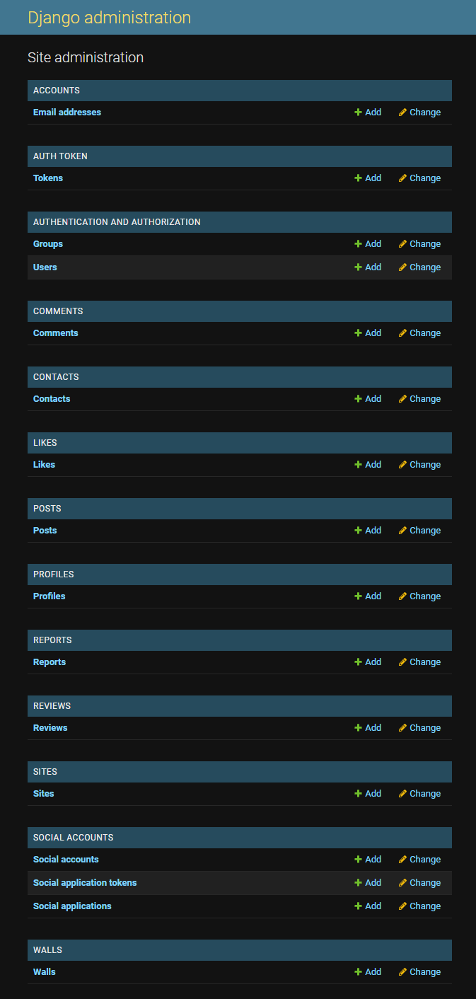

# drf-api
"drf-api"" is the backend service used by the [Connect](https://github.com/TiagoMA90/connect) platform.
The deployed API can be found [here](https://djangorestframework-api-38c4a098777a.herokuapp.com/)

# Purpose of the API:
To serve as the Back bone for the Front-end, by posting and getting data from endpoints.

## Agile
(ELABORATE)
[IMAGE of the User Stories]

## User Stories

## Relationship Diagram
The relationship diagram between models from an individual perspective can be best defined as follows:
An individual Profile (authenticated) associated to a User can CRUD multiples Posts and CRUD multiple Comments either to a single or multiple Posts, Users can also Like/Dislike multiple Posts (but their own) or Report multiple Posts. Furthermore, Users can Follow/Unfollow multiple Profiles. Lastly (non-authenticated) Users can send messages via Contact.

- The [Profile](https://djangorestframework-api-38c4a098777a.herokuapp.com/profiles/) flaunts the owner(OneToOne), image(ImageField), content(TextField), name(CharField), created_at(DateTimeField) and updated_at(DateTimeField)
- A [Post](https://djangorestframework-api-38c4a098777a.herokuapp.com/posts/) created by a User Profile, features the owner(ForeignKey), created_at(DateTimeField), updated_at(DateTimeField), title(CharField), content(TextField), image(ImageField) and image_filter(CharField) once submited
- The [Comments](https://djangorestframework-api-38c4a098777a.herokuapp.com/comments/) model takes a similar approach, inheriting the post(ForeignKey) and owner(ForeignKey), it displays the content(TextField), created_at(DateTimeField), updated_at(DateTimeField) of the comment
- The [Like](https://djangorestframework-api-38c4a098777a.herokuapp.com/likes/) marked by the owner(ForeignKey), post(ForeignKey) and created_at(DateTimeField)
- The [Follower](https://djangorestframework-api-38c4a098777a.herokuapp.com/followers/) defined by owner(ForeignKey), followed(ForeignKey), created_at(DateTimeField)
- Then the [Report](https://djangorestframework-api-38c4a098777a.herokuapp.com/reports/) functionality enlists a tuples for REASON_CHOICES, followed by the reporter(ForeignKey) and post(ForeignKey), reason(CharField), description(TextField) and created_at(DateTimeField)
- The [Contact](https://djangorestframework-api-38c4a098777a.herokuapp.com/contacts/) form finally makes use of the name(CharField) and email(EmailField) for external users, subject(Charfield), message(TextField), created_at(DateTimeField).

Under Barkers notation. One/Many Profiles can create many Posts. Many Comments can be created in many Posts by one/many Profiles. One Likes/Unlikes can be created in many Posts by one/many Profiles. Many Reports can be created on many Posts by one/many Profiles. One/Many Profiles can follow/unfollow many Profiles. Contacts should be considered an isolated model as it is accessible by anyone, ergo many Users.

[IMAGE of the diagram]

## Features and Functionality for Superusers
- CRUD Posts.
- CRUD Comments
- CRUD Profiles
- CRUD Contacts
- CRUD Reports
- Change Passwords.
- Promote users to Superuser.



[IMAGE of the Admin Panel]

## Manual Testing
Manual Testing for the overall functionality of the API was performed through [/admin](https://djangorestframework-api-38c4a098777a.herokuapp.com/admin/)

CI Python Linter was also used in parallel with the development of the API, to keep the code free of errors.
The Code has not exhibited apparent errors.


## Installed Python Packages
The following packages were installed when developing this project:
To install, the following command ran: ```pip install``` ...
- ```Pillow==8.2.0```
- ```psycopg2==2.9.6```
- ```cloudinary==1.25.0```
- ```dj-database-url==0.5.0```
- ```dj-rest-auth==2.1.9```
- ```Django==3.2.4```
- ```django-allauth==0.44.0```
- ```django-cloudinary-storage==0.3.0```
- ```django-cors-headers==3.7.0```
- ```django-filter==2.4.0```
- ```djangorestframework==3.12.4```
- ```djangorestframework-simplejwt==4.7.2```
- ```gunicorn==20.1.0```
- ```PyJWT==2.1.0```

## Package Dependencies
- asgiref==3.3.4
- cryptography==3.4.8
- oauthlib==3.1.1
- python3-openid==3.2.0
- pytz==2021.1
- requests-oauthlib==1.3.0
- sqlparse==0.4.1
- urllib3==1.26.15

# Development & Deployment
The project was developed using GitHub and GitPod platforms...
- Navigate to: "Repositories" and create "New".
- Mark the following fields: ✓ Public ✓ Add a README file.
- Select template: "Code-Institute-Org/python-essentials-template".
- Add a Repository name: "drf-api".
- ...and create Repository.

... and suffered various executions using the inbuild Terminal.

For Commits on this project, the following commands ran:
- ```git add .``` <- Stages before commiting.
- ```git commit -m "written imperative declaration"``` <- Declares changes and updates.
- ```git push``` <- Push all updates to the GitHub Repository.

To run the server locally (Debug = True), the following command ran:
- ```python manage.py runserver``` <- Loads the website on the in-built Terminal.

During development migrations to the database were made.
To make migrations the following commands ran:
- ```python manage.py makemigrations``` <- Creates a new database migration
- ```python manage.py migrate``` <- Applies pending migrations

To create or update Requirements.txt file the following commands ran:
- ```pip3 freeze --local > requirements.txt```  <-Runs the req.
- ```pip install -r requirements.txt``` <- Install req.

To create a Superuser the following command ran (from Heroku terminal): 
- ```python manage.py createsuperuser``` (username->email->password1->password2) <- Creates a Superuser

To create a new Django project, in the currenct directory, the followig command ran:
- ```django-admin startproject NAMEOFTHEPROJECT .``` <- Starts the project

To create the app the following command ran:
- ```python3 manage.py startapp NAMOFTHEAPP``` <- Creates a folder for the app withing the project

## Languages & Technologies
- Django REST Framework (Python Framework - API)

## Other forms of development
- [CI Python Linter](https://pep8ci.herokuapp.com/) - CI Python testing tool
- [Diagrams](https://app.diagrams.net/) - Diagram set up
- [Github](https://github.com/) - Host for the repository
- [Gitpod](https://gitpod.io/) - Code editor
- [ElephantSQL](https://www.elephantsql.com/) - Database
- [Cloudinary](https://cloudinary.com/) - Static & Media host
- [Heroku](https://id.heroku.com/) - Cloud platform/Host the live project

## Credits
The following sources and references were resorted for the creation of this website:
- This project evolved from the lessons and tutorials provided by Code Institute, on the final module entitled "Django REST Framework" for the Advanced Front End specialization
- Tutor assistance provided by Code Institutes Student Support
- Slack(#project-portfolio-5-advanced-frontend) was used as a solution platform for broken code and guidance on how to procceed on blockades